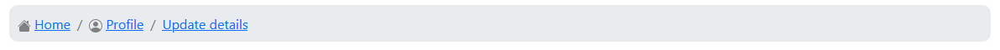

# Bootstrap UI for Golang <a href="https://gitpod.io/#https://github.com/gouniverse/bs" target="_blank" style="float:right;"></a>

An extensive Golang library for declaratve building of Bootstrap components. 

Its an extension of the HTML Builder package: https://github.com/gouniverse/hb

You can find different examples below.

## Alerts

```golang
bs.Alert().Class("alert-info").HTML("Info text")

bs.Alert().Class("alert-danger").HTML("Danger text")

bs.Alert().Class("alert-success").HTML("Success text")

bs.Alert().Class("alert-warning").HTML("Warning text")
```

## Breadcrumbs

```golang
breadcrumbsPath := []bs.Breadcrumb{
	{
		Name: "Home",
		URL:  "/users",
		Icon: icons.Icon("bi-house-fill", 16, 16, "gray").ToHTML(),
	},
	{
		Name: "Profile",
		Icon: icons.Icon("bi-person-circle", 16, 16, "gray").ToHTML(),
		URL:  "/users/profile",
	},
	{
		Name: "Update details",
		URL:  "/users/profile/update",
	},
}

breadcrumbs := bs.Breadcrumbs(breadcrumbsPath).Style("background:#e9ecef;border-radius:10px;padding:10px;margin-bottom:10px;")
```

Result


## Cards

```golang
card := bs.Card().ID("CardPreview").AddChildren([]hb.TagInterface{
	bs.CardHeader().Child(hb.NewHeading5().HTML("Preview")),
	bs.CardBody().Child(preview),
})
```

## Tabs

```golang
bs.NavTabs().Children([]hb.TagInterface{
	bs.NavItem().Children([]hb.TagInterface{
		bs.NavLink().Class("active").Children([]hb.TagInterface{
			hb.NewSpan().HTML("Overview"),
		}),
	}),
	bs.NavItem().Children([]hb.TagInterface{
		bs.NavLink().Children([]hb.TagInterface{
			hb.NewSpan().HTML("Statistics"),
		}),
	}),
	bs.NavItem().Children([]hb.TagInterface{
		bs.NavLink().Children([]hb.TagInterface{
			hb.NewSpan().HTML("Preview"),
		}),
	}),
}),
```

## Pills

```golang
bs.NavPills().Children([]hb.TagInterface{
	bs.NavItem().Children([]hb.TagInterface{
		bs.NavLink().Class("active").Children([]hb.TagInterface{
			hb.NewSpan().HTML("Overview"),
		}),
	}),
	bs.NavItem().Children([]hb.TagInterface{
		bs.NavLink().Children([]hb.TagInterface{
			hb.NewSpan().HTML("Statistics"),
		}),
	}),
	bs.NavItem().Children([]hb.TagInterface{
		bs.NavLink().Children([]hb.TagInterface{
			hb.NewSpan().HTML("Preview"),
		}),
	}),
}),
```
